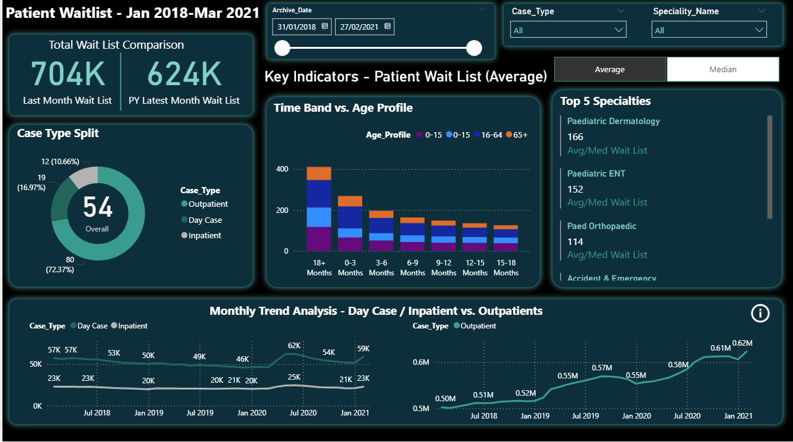
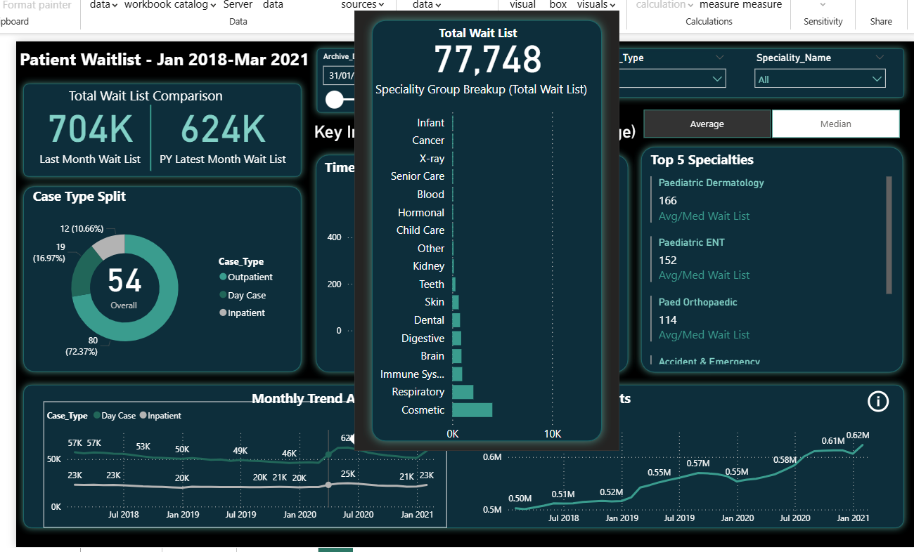
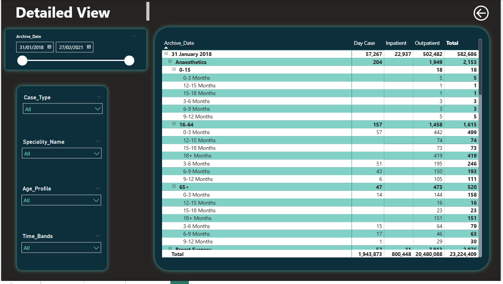

# 🏥 Patient Waitlist Dashboard (Power BI)

As you may already know from my CV, I currently work in **patient transport**, which has given me firsthand exposure to hospital operations and the challenges of long waiting lists.  
To combine that experience with my growing technical skill set, I’ve built this **interactive Power BI dashboard** to analyse and visualise hospital patient waitlist data.

This project is designed to show hiring managers a **real example of my ability to gather requirements, model data, build DAX measures, and create clean, dynamic dashboards** that tell a story and drive decision-making.

---

## 📊 Project Overview

This project is an **end-to-end Power BI solution** designed to track and analyse **hospital patient waitlists** across multiple specialties, case types, and time bands.

It demonstrates:
- Requirement gathering & stakeholder analysis  
- Data collection & transformation (Power Query)  
- Data modeling & relationships  
- DAX measures for KPI calculation  
- Dashboard layout, design, and interactivity  
- Drillthrough & tooltip pages  
- Monthly trend analysis & specialty-level insights  

This dashboard uses **publicly available NHS patient waitlist data** and applies a **dark, clinical theme** for a professional look and feel.

---

## 🎯 Business Problem

Hospitals need to:
- Monitor patient waitlist volumes (current & historical)
- Track average/median wait times by **case type** (inpatient, day case, outpatient)
- Identify specialty backlogs and age-specific bottlenecks
- Support data-driven decisions on capacity planning

This dashboard provides **real-time visibility** of the patient backlog and helps stakeholders allocate resources effectively.

---

## 🏗️ Development Process  

This project followed a professional **nine-step dashboard development cycle**:

1. **Requirement Gathering:** Defined stakeholders, objectives, and KPIs.  
2. **Data Collection:** Combined inpatient and outpatient data from source files.  
3. **Data Transformation:** Cleaned, aligned, and appended tables into `All_Data`.  
4. **Data Modeling:** Built relationships with a specialty mapping table.  
5. **Visualisation Blueprint:** Designed summary page, detailed matrix view, and tooltip pages.  
6. **Dashboard Layout & Design:** Created DAX measures (`Latest Month Wait List`, `PY Latest Month Wait List`, `Avg/Med Wait List`, `Dynamic Title`) and designed toggle buttons.  
7. **Interactivity:** Added slicers, navigation, tooltips, and conditional messages.  
8. **Testing & Sharing:** Verified calculations and design consistency.  
9. **Maintenance Plan:** Designed for monthly refresh with folder data source.

---

## 📷 Dashboard Screenshots  

| Summary View | Drillthrough Tooltip | Detailed Page |
|-------------|--------------------|--------------|
|  |  |  |

> **Interactive Features:** Hover over trend lines for specialty breakdowns, filter by case type, time band, or specialty. Toggle between Average & Median calculations dynamically.

---

## 🧠 Key Learnings  

- Building **robust data models** with appended tables and consistent schemas  
- Creating **dynamic DAX measures** to drive interactivity  
- Designing **dark-theme dashboards** with clear visual hierarchy  
- Using **tooltips and navigation buttons** to enhance user experience  
- Following a structured development process from requirement gathering to deployment

---

## 🛠️ Tech Stack

- **Power BI Desktop**
- **Power Query** for ETL
- **DAX** for measures & calculations
- **Excel/CSV** data sources

---

## 📂 Repository Structure  

```plaintext
📁 Patient-Waitlist-Dashboard
 ┣ 📂 pbix/                # Power BI .pbix file
 ┣ 📂 screenshots/         # High-res dashboard screenshots
 ┗ 📄 README.md            # Project documentation (this file)
